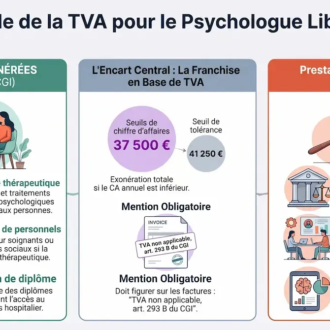

*Temps de lecture : environ 9 minutes*

Quand je me suis installé en libéral il y a maintenant plus de 15 ans, j'ai vraiment découvert un aspect de mon métier que je ne connaissais pas. Apprendre à gérer un certain nombre de choses que jusqu'à présent mon employeur gérait à ma place ! Avoir des patients, gérer les rendez-vous, me verser un salaire, cotiser pour la retraite. Beaucoup d'anxiété qui au départ ne laissent pas beaucoup de place à la clinique. C'est pourquoi j'ai conçu ce mini guide pour te guider dans le processus d'installation en libéral.

S’installer en libéral comme psychologue, ce n’est pas seulement « ouvrir un cabinet ». C’est prendre des décisions qui touchent à la fois ton cadre clinique, ton organisation, des formalités administratives et une façon de vivre ton métier au quotidien. Derrière une recherche comme **« s’installer en libéral psychologue »** ou **« ouvrir cabinet psychologue »**, il y a souvent une même question : par quoi commencer pour ouvrir son cabinet de psychologue sans se disperser ni fragiliser son cadre ?

Si tu veux gagner du temps, je peux t’envoyer le **guide complet d’installation** par mail (version longue, structurée, avec checklists, erreurs classiques et exemples concrets).

👉 Écris-moi via [la page contact](/contact/) en commençant ton message par **« Guide installation libéral psy »**.

## S’installer en libéral comme psychologue : clarifier ton projet

Le libéral attire pour de bonnes raisons : cadre qui te ressemble, lien plus direct avec ta pratique, possibilité de faire évoluer ton activité. Il a aussi un revers souvent sous-estimé : tu portes en parallèle la clinique et la gestion d’une petite activité (agenda, paiements, imprévus, irrégularité des revenus au début).

Avant de penser statut ou local, il est utile de rendre ton projet cohérent avec tes valeurs et tes besoins : publics que tu souhaites recevoir et pour lesquels tu es formé.e, modalités (cabinet, visio, les deux), orientation, rythme que tu vises. **Ouvrir un cabinet de psychologue**, ce n’est donc pas seulement trouver un lieu de consultation : c’est construire un cadre cohérent, compréhensible et tenable dans le temps. Ce n’est pas une question de marketing : c’est ce qui permet à des patients, à des confrères ou à des prescripteurs de comprendre rapidement **à qui tu t’adresses** — et ce qui t’aide à t’installer en libéral.

Il y a aussi un préalable simple, mais qu’il vaut mieux poser clairement : l’usage du titre de psychologue est protégé. Avant de communiquer, louer un cabinet ou lancer tes démarches, vérifie que ton diplôme et tes justificatifs te permettent bien d’obtenir ton enregistrement professionnel. Si tu as un parcours atypique, une équivalence, une activité mixte ou une reprise après plusieurs années, c’est typiquement le genre de point à clarifier avant d’investir dans le reste.

Enfin, prends une heure pour regarder ton **territoire d’installation**. Pas besoin d’une étude de marché lourde : observe les psychologues déjà présents, leurs publics affichés, les délais de rendez-vous, les tarifs pratiqués, les lieux de soin autour de toi, les écoles, entreprises, maisons de santé ou médecins susceptibles d’orienter. Quand je me suis installé en libéral à Sceaux, je savais qu'il y avait des collègues psychologues autour de moi, mais qu'il y avait encore de la place pour une offre de consultation.  

Beaucoup de psychologues gagnent en sérénité en envisageant aussi une **montée en charge progressive** (par exemple cumul avec un salariat) plutôt qu’un basculement brutal. Ce n’est pas la seule voie, mais c’est souvent celle qui limite le choc des premiers mois. Au début, je travaillais en institution à temps plein et j'allais faire quelques consultations le soir après le travail. J'ai très rapidement du passer à temps partiel car mon activité a très vite pris de l'ampleur.

### Points de vérification préalables

Avant toute démarche, tu peux t'appuyer sur ces 6 points :

- ta **population cible prioritaire** ;
- ton **cadre de consultation** (cabinet, visio, hybride) ;
- ton **volume réaliste** de consultations par semaine;
- ton **seuil de viabilité financière** (charges fixes + minimum de sécurité perso) ;
- ton **territoire d’installation** (demande locale, concurrence, prescripteurs possibles) ;
- tes **justificatifs de titre** et documents utiles pour l’enregistrement professionnel.

Si la question financière est déjà centrale pour toi, l’article sur le [salaire d’un psychologue libéral](/blog/salaire-psychologue-liberal/) détaille les honoraires, les charges, les cotisations et les scénarios de revenu net.

Dans le guide PDF que j'ai réalisé, je détaille une version complète de cette check-list avec un canevas prêt à remplir.

## Les démarches administratives

Sur le papier, tout se mélange : santé, entreprise, protection sociale, fiscalité. En pratique, une chronologie simple aide beaucoup :

1. **T’assurer que tu peux faire usage du titre** et rassembler les justificatifs utiles avant de te lancer dans les formulaires.
2. **T’enregistrer comme psychologue** auprès de l’ARS et obtenir ton numéro **RPPS**.
3. **Déclarer ton activité indépendante** sur le guichet unique (INPI / procédures en ligne), ce qui lance l’immatriculation et te donne les identifiants d’activité (SIREN, SIRET, code APE…).
4. **Anticiper ce qui s’enchaîne** : organismes sociaux, échéancier des cotisations, assurance **responsabilité civile professionnelle**, compte dédié à l’activité, demandes comme l’ACRE lorsque tu y as droit, mentions obligatoires sur tes documents si tu es en entreprise individuelle.

Selon ta situation, pense aussi aux dispositifs qui peuvent sécuriser le démarrage : maintien partiel de l’ARE, ARCE, ACRE, prêt d’honneur, aide locale, accompagnement par une structure de création d’activité. Ce ne sont pas des cases obligatoires pour tout le monde, mais les regarder avant l’ouverture peut éviter de découvrir trop tard une aide compatible avec ton projet.

## Statut juridique : souvent l’entreprise individuelle, puis micro ou réel

Le point de départ le plus fréquent est l’**entreprise individuelle**. Ce n’est pas la seule option juridique possible, mais c’est souvent le cadre le plus simple quand l’activité repose essentiellement sur ton travail personnel.

Ensuite, la question qui revient le plus souvent est : **micro-BNC** ou **déclaration contrôlée (réel)** ? En résumé très court :

- le **micro** simplifie la vie : logique de chiffre d’affaires, abattement forfaitaire, moins de granularité sur les frais réels ;
- le **réel** correspond mieux lorsque les charges et investissements deviennent significatifs, ou lorsque la structure de ton activité rend le forfait peu représentatif.

> 💡 **À retenir** : ton meilleur statut “sur le papier” n’est pas forcément le meilleur pour ton contexte réel (charges, rythme de montée, activités annexes, projections à 12 mois).

## Fiscalité et charges : ce que tu encaisses n’est pas ce qu’il te reste

En libéral, tu raisonnes en **honoraires** et en **BNC** : pas de fiche de paie « net » prête à l’emploi comme lorsque tu es salarié. Il faut distinguer recettes, charges, cotisations sociales et impôt — et regarder de près le cas particulier de la **TVA**, souvent mal compris chez les psychologues.

Le principe est contre-intuitif : en tant que profession libérale, tu es **assujetti·e à la TVA par défaut**. Ce qui change la donne, c’est que certaines prestations peuvent en être **exonérées** (et c'est notre cas pour la plupart de nos interventions):

- les **actes cliniques de soins à la personne** (suivis, psychothérapies, bilans à visée thérapeutique…) relèvent de l’exonération prévue par l’**article 261 du CGI** ;
- à l’inverse, des activités comme la **formation**, la **supervision hors cadre de soin**, le **conseil aux organisations**, les **expertises rémunérées** ou des **ateliers de bien-être** ne rentrent pas toujours dans ce cadre et peuvent rester soumises à TVA.

Autrement dit, l’exonération ne découle pas automatiquement du titre de psychologue : elle dépend **de la nature concrète de chaque prestation**. Un même cabinet peut donc avoir des actes exonérés et d’autres taxables.

Deux pièges fréquents à éviter :

- **Confondre exonération et franchise en base**. Les deux font que tu ne factures pas de TVA, mais pour des raisons juridiques différentes — et la mention à porter sur la facture n’est pas la même (exonération au titre de l’art. 261 CGI pour les soins, ou `TVA non applicable, art. 293 B du CGI` pour la franchise en base sur les activités soumises mais sous seuil).
- **Oublier les charges « silencieuses »** qui ne dépendent pas du nombre de séances dans le mois (typiquement la **CFE**, qui arrive en général dès la deuxième année d’activité, selon les règles applicables à ta commune et à ta situation).

Ajoute à cela une réserve de trésorerie réaliste. Les premiers mois peuvent être irréguliers, même avec un bon positionnement : le temps que les patients trouvent ton cabinet, que les orientations se mettent en place et que ton agenda se stabilise, tu dois pouvoir absorber l’écart entre tes charges fixes et tes recettes réelles.
Quand je me suis installé j'ai trouvé rassurant et confortable d'avoir déjà une activité en institution et un salaire qui me permettait d'envisager les rendez-vous en libéral sans trop de stress financier.

Pour aller plus loin sur ces sujets (TVA, CFE, cotisations, régime fiscal), je peux t’envoyer par mail le **guide complet au format PDF**. Tu y retrouveras des exemples chiffrés, les mentions exactes à faire figurer sur tes factures et les points de vigilance à valider avec ton expert-comptable.

👉 [**Demander le guide par mail**](/contact/)

## Le cabinet : un choix clinique autant qu’économique

Domicile, sous-location à temps partagé, bail professionnel, maison de santé… Chaque option a des effets sur ton budget et sur la manière dont tu vis ton cadre au quotidien.

Ce qui revient souvent comme bon compromis au démarrage : un **vrai lieu professionnel** (même partagé quelques demi-journées) plutôt qu’une solution « bricolée » qui fragilise le cadre ou la séparation vie pro / vie perso. Les points non négociables restent en général : **isolement phonique**, circulations discrètes, salle d’attente digne de ce nom, sensation de sécurité pour la personne qui entre.

Si ton objectif est d’ouvrir un cabinet de psychologie identifiable localement, pense aussi au très concret : adresse stable, accès simple, cohérence entre le nom affiché sur la porte, la fiche Google, le site internet et les documents remis aux patients. Ce sont des détails administratifs en apparence, mais ils participent à la confiance et au référencement local si tu as un site internet (ce que je te recommande).

Regarde également les sujets d’**accessibilité** et de signalétique avant de signer : accès PMR, contraintes éventuelles d’établissement recevant du public (ERP), affichage dans l’immeuble, plaque professionnelle, règles de copropriété, autorisation d’exercice dans le local. Ce sont des détails moins visibles que le fauteuil ou la décoration, mais ils peuvent devenir très concrets au moment d’accueillir les patients.

Si tu sous-loues, le sujet n’est pas seulement le prix : c’est la **solidité du cadre** (autorisation dans le bail principal, accord écrit, assurance, responsabilités claires). Un cabinet « pas cher » mais juridiquement flou peut coûter très cher ensuite.

Dans le guide complet, tu retrouves une matrice de comparaison simple pour trancher entre domicile, sous-location et bail pro selon ton profil.

## Se rendre visible

Tu peux rendre ton activité repérable **sans** adopter une communication marketing. Le **Code de déontologie des psychologues** (version actualisée de 2021) encadre précisément ce point, dans son chapitre V *Diffusion de la psychologie*.

Son **article 32** est explicite : « *La·le psychologue diffuse au public une information sur son activité professionnelle **avec mesure** et **en référence à son titre**, y compris lorsqu’elle·il a recours à la publicité pour son exercice libéral.* » La publicité n’est donc pas interdite, mais elle est encadrée.

Concrètement, plusieurs principes en découlent :

- **mesure et référence au titre** (art. 32) : tu communiques en t’appuyant sur ton titre de psychologue, tes qualifications réelles et tes champs d’intervention — pas sur des promesses, des superlatifs ou une mise en scène commerciale ;
- **rigueur et circonspection sur les méthodes** (art. 31) : tu présentes tes méthodes et outils avec prudence, sans en exagérer la portée ni laisser entendre qu’ils règlent mécaniquement tel ou tel trouble ;
- **responsabilité dans l’image de la profession** (art. 30) : ce que tu diffuses publiquement (site, réseaux sociaux, fiche locale, interviews) engage aussi l’image de l’ensemble de la profession ;
- **secret professionnel et confidentialité** (principe 2 et art. 7, renvoyant aux articles 226-13 et 226-14 du code pénal) : pas de **témoignages patients** utilisés comme argument commercial, même anonymisés, ni d’« avant/après » cliniques ;
- **protection du titre** (loi n° 85-772 du 25 juillet 1985, art. 44) : seul l’usage du titre de psychologue, par une personne remplissant les conditions légales et enregistrée comme professionnelle, est autorisé — d’où l’importance de faire figurer ton numéro **RPPS** sur tes documents professionnels (art. 18).

Ce cadre n’est pas un frein à la visibilité : c’est ce qui rend ta communication **crédible** auprès des patients et des prescripteurs. Une présentation sobre et précise (« j’accompagne les adultes en période de transition professionnelle ou personnelle, avec une approche X ») fonctionne mieux, sur la durée, qu’un argumentaire marketing. 

C'est réalisant le site internet de mon cabinet de psychologue il y a 15 ans que j'ai eu l'idée et l'envie d'aider mes collègues à réaliser le leur. Cela demande du temps et des compétences que j'avais déjà acquises et je pouvais enfin les utiliser pour quelque chose qui avait de la valeur pour moi.  

Dans les faits, beaucoup de psychologues combinent :

- une **fiche locale** (souvent Google Business Profile) pour être trouvé « près de chez soi » ;
- un **site internet** pour expliquer l'approche, le public, les modalités et rassurer avant le premier contact ;
- éventuellement une **plateforme de rendez-vous** (Doctolib ou autre), utile pour l’accès et les prises de rendez-vous mais rarement suffisante à elle seule pour dire qui tu es cliniquement et pour rassurer les patients.

La cohérence des informations (**nom, adresse, téléphone**) entre ces canaux compte beaucoup pour le référencement local. Le [guide complet de la visibilité en ligne](/blog/guide-complet-visibilite-en-ligne-psychologues/) et la page [référencement site psychologue](/referencement-site-psychologue/) détaillent cette logique côté web.

### Ce qui aide pour avoir tes premiers patients

Pas besoin d'en faire trop. En pratique, les profils qui fonctionnent bien ont surtout :

- une proposition claire en 2-3 lignes ;
- des informations pratiques immédiatement visibles ;
- un ton rassurant, sans promesse excessive ;
- un parcours de contact simple (email + téléphone + formulaire clair).

Le guide par mail inclut un modèle de structure de page d’accueil orientée “premier contact”.

## Accueillir les premiers patients : le cadre avant la technique

Les premiers rendez-vous posent souvent **le cadre** autant que la demande : durée, fréquence, tarif, annulations, confidentialité, modalités de prise de contact. Plus c’est dit tôt et simplement, moins tu perds d’énergie à recoller des malentendus plus tard.

Côté outils (agenda, dossier patient, facturation), le piège classique est de confondre des usages : **un agenda n’est pas un dossier patient**, une messagerie pratique n’est pas forcément un outil clinique conforme à ce que tu stockes comme données. Si tu traites des données sensibles, la prudence sur l’hébergement et la conformité n’est pas une option « pour les gros cabinets ».

## Plan d’action

- **Semaine 1** : cadrage du projet + lecture du territoire + choix du mode de démarrage ;
- **Semaine 2** : démarches administratives + base assurantielle ;
- **Semaine 3** : cadre de pratique (lieu, accessibilité, outils, organisation) ;
- **Semaine 4** : **mise en ligne du site professionnel** + visibilité locale + ouverture progressive des créneaux.

Le **site internet** mérite d’être préparé en parallèle des autres chantiers, pas relégué « pour plus tard » : c’est souvent le premier point de contact réel avec les patients, et il structure ensuite toute la communication (fiche Google, Doctolib, cartes de visite, mails). Un site sobre, bien pensé, qui présente clairement ton titre, ton approche, tes publics et tes modalités fait davantage pour ta crédibilité que n’importe quelle campagne publicitaire — et c’est aussi ce qui te rend **indépendant des plateformes** sur la durée.

> 💡 Si tu veux gagner du temps sur cette étape, j’accompagne spécifiquement les psychologues dans la **création de leur site** : contenu, structure, référencement local, conformité (mentions légales, RGPD, cadre déontologique). Voir la page [création de site web pour psychologue](/creation-site-internet-psychologue/), les [tarifs](/tarifs/) ou demander un [diagnostic gratuit](/diagnostic-gratuit/) de ta situation actuelle.

Tu veux la version détaillée du plan 30 jours (priorités quotidiennes, documents à préparer, points de vigilance) ? Je te l’envoie par mail.

## Questions fréquentes avant de s’installer en libéral comme psychologue

### Quelles sont les premières étapes pour ouvrir un cabinet de psychologue ?

Les premières étapes consistent à clarifier ton projet clinique, vérifier ton droit d’usage du titre, obtenir ton enregistrement professionnel, déclarer ton activité indépendante, choisir ton régime fiscal, assurer ton activité et préparer ton lieu d’exercice. Le bon ordre dépend de ta situation, mais l’idée centrale reste la même : ne pas séparer les démarches administratives du cadre réel dans lequel tu vas recevoir.

### Peut-on ouvrir son cabinet de psychologue progressivement ?

Oui. Beaucoup de psychologues démarrent avec quelques demi-journées en cabinet partagé, parfois en cumul avec un salariat. Cette montée progressive peut limiter la pression financière, tester le rythme réel des demandes et ajuster le cadre avant de prendre un bail plus engageant.

### Faut-il un site internet dès l’ouverture du cabinet ?

Ce n’est pas une obligation légale, mais c’est souvent utile dès le départ. Un site clair aide les patients et les prescripteurs à comprendre qui tu reçois, où tu consultes, comment prendre contact et dans quel cadre tu travailles. Il soutient aussi ta visibilité locale, surtout quand il est cohérent avec ta fiche Google Business Profile.

## Ce que cet article ne remplace pas

Tu n’y trouveras pas :

- une checklist exhaustive jour par jour ;
- des montants ou seuils « figés » pour ton année fiscale ;
- une analyse de ton cas personnel (statut mixte, activités annexes, TVA, société, etc.).

Tu y trouves en revanche une **structure** : préparer le projet, enchaîner les démarches, choisir un cadre juridico-fiscal avec de l’aide, anticiper les charges, choisir un lieu cohérent, devenir visible avec sérieux, poser un accueil solide.

## Recevoir le guide complet par mail

Si tu veux avancer plus vite avec un plan clair, je peux t’envoyer gratuitement le **guide complet d’installation en libéral pour psychologues**.

### Ce que tu reçois

- une check-list complète (ordre des démarches + pièces à préparer) ;
- un comparatif simple des options de démarrage ;
- les erreurs fréquentes à éviter les 3 premiers mois ;
- un plan d’action détaillé pour passer de l’idée aux premiers rendez-vous.

### Comment le demander

1. Va sur [la page contact](/contact/).
2. Commence ton message par : **« Guide installation libéral psy »**.
3. Indique ton contexte en 2 lignes (début, reprise, cumul salariat, visio, cabinet, etc.).

Je te réponds par mail avec la meilleure version du guide selon ta situation.

En résumé : s’installer en libéral, ce n’est pas une course contre la montre. C’est un enchaînement d’étapes où **l’ordre et la clarté** valent souvent plus qu’un surplus d’information brut. Une fois la carte en tête, chaque chapitre mérite l’attention calmement — et tu n’as pas besoin de tout savoir avant de faire le premier pas utile.
